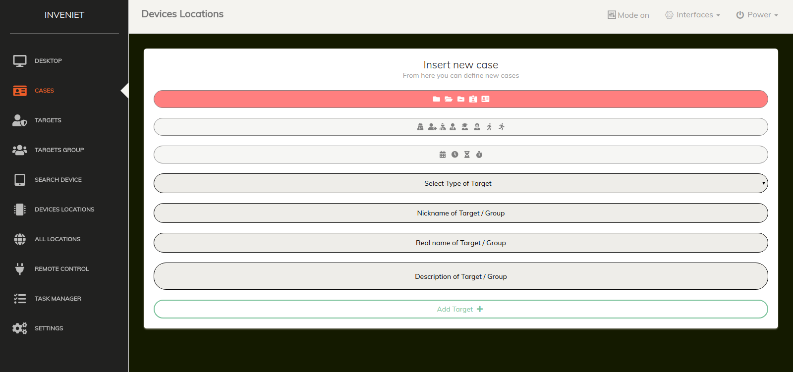

# inveniet
To inveniet is a program for locating computers tablets and mobile phones

Details inveniet   
finding location of computers, latops, tablets  and mobile phones  
Live follow-up of multi-device locations  
plan of all devices connected to the system  
plan of the device separately on the map  
device search  
block any device  
set time for sending the locations  

1) Installation instructions   
   
  i) Import the file database.sql from sql folder to your database system  
  ii) View locations in map save to 9 locations  
      For view multiple locations  
      INSERT into phpmyadmin from administrator account  
      Go to home and go to variables tab  
      Insert end find group_concat_max_len  
      Press edit and change value  
      SET variables group_concat_max_len = 1000000;  
  iii) Copy the inveniet program and paste in one folder into /var/www/  
  iiv) The inveniet program is ready for use     
  
 
2) To find the location of the devices   
   
   i) Send the following link to the user you want to locate  
      The link is your url and your username api key  
      
      example url: https://localhost/view.php?=makdosx         
      
  ii) Create case for track a target  
      The link is your url and your set target name   
      Create case for track a target group  
      The link is your url and your set target group name   
      After find tha target or target groups view results  
      The results is ip,instant, longitude and latitude and other informations  
      The informations of this links are encrypted  
      Example url target:  https://192.168.2.30/view_tar.php?=Vrqit4ytnKysj6rApr6%2B  
      Example url target group: https://192.168.2.30/view_tar_gro.php?=Vrqit4yepZppYpQ%3D  
      
     

      
   iii)  Find tablet and mobile phone location  
    To run the program on tablets and mobile phones, the user should have an Internet connection such as wifi or cellular data and have opened its location or the gps to your find its exact location   
   
   iv) Finding a Computer Location  
   To identify computers and laptops you need one connection to the Internet. The location here may vary a few meters because you do not use gps as on tablets and cell phones   
  
   
   
   
   
   
   
   
   
   
   
   
   
   
   
   
