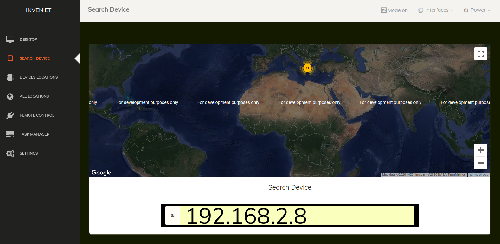

# inveniet
To inveniet is a program for locating computers tablets and mobile phones

Details inveniet   
finding location of computers, latops, tablets  and mobile phones  
Live follow-up of multi-device locations  
plan of all devices connected to the system  
plan of the device separately on the map  
device search  
block any device  
set time for sending the locations  

1) Installation instructions   
   
  i) Import the file database.sql from sql folder to your database system  
  ii) Copy the inveniet program and paste in one folder into /var/www/  
  iii) The inveniet program is ready for use     
  
 
2) To find the location of the devices   
   
   i) Send the following link to the user you want to locate  
      The link is your url and your username api key  
      
      example url: https://localhost/view.php?=makdosx         
      
   ii)  Find tablet and mobile phone location  
    To run the program on tablets and mobile phones, the user should have an Internet connection such as wifi or cellular data and have opened its location or the gps to your find its exact location   
   
   iii) Finding a Computer Location  
   To identify computers and laptops you need one connection to the Internet. The location here may vary a few meters because you do not use gps as on tablets and cell phones   
  
   
   
   
   
   
   
   
   
   
